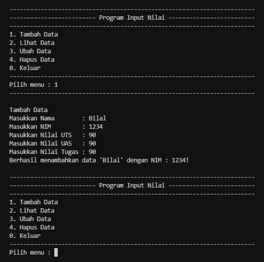
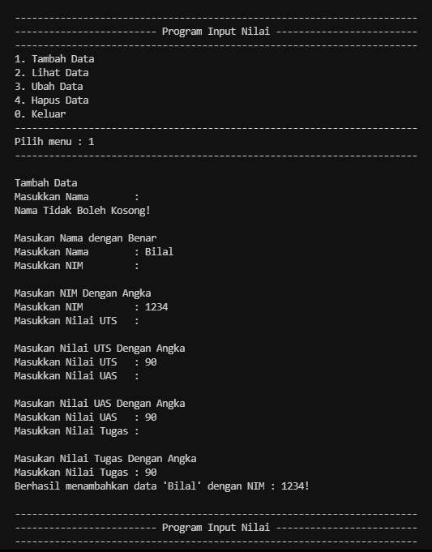
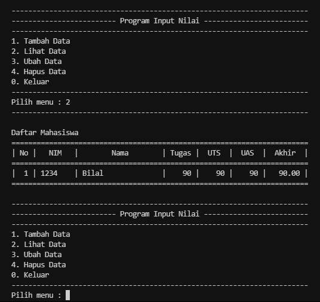
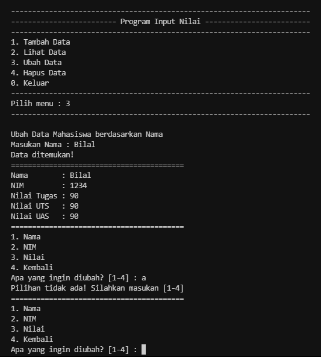
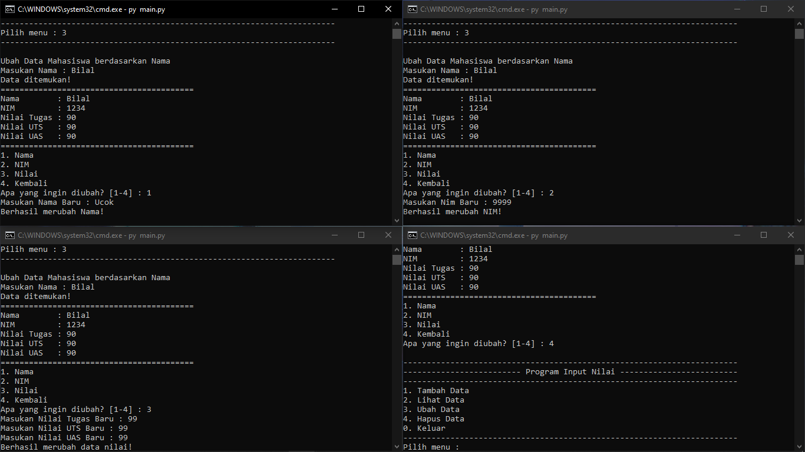
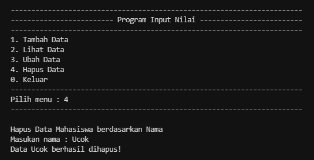
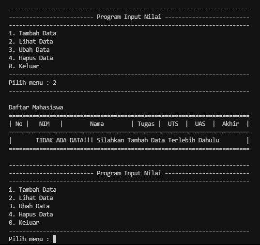

# Pertemuan 13
## Daftar Isi
* [Program Input_Data](https://github.com/kyuurazz/try-and-except#program-input_data)
* [Program Main](https://github.com/kyuurazz/try-and-except#Program-main)
    * [Tambah Data](https://github.com/kyuurazz/try-and-except#tambah-data)
    * [Lihat Data](https://github.com/kyuurazz/try-and-except#lihat-data)    
    * [Ubah Data](https://github.com/kyuurazz/try-and-except#ubah-data)
    * [Hapus Data](https://github.com/kyuurazz/try-and-except#hapus-data)  

Konsep Program:

> Implementasikan penggunaan eksepsi pada lab-lab sebelumnya untuk mengatasi error yang ditimbulkan.

## Penjelasan:

- Terdapat dua program pada repository ini. Yang pertama Program `input_data` yang berisi variabel Nama, NIM, Nilai Tugas, Nilai UTS, dan Nilai UAS. Yang kedua Program `main.py` yaitu sebagai aplikasi utama untuk menjalan kan program. Terdapat beberapa fungsi didalam program `main.py` antara lain yaitu Tambah Data, Lihat Data, Ubah Data, dan Hapus Data.

### Program input_data

- Membuat variable nama, nim, tugas, uts dan uas menggunakan fungsi Variable Global
- Apa itu Variabel Global? variabel global adalah variabel yang selalu bisa diakses kapan pun dan di mana pun. Bahkan dari file yang berbeda sekalipun.
- Lalu, ditambah dengan perulangan menggunakan while
- Dan menambahkan statement try and except 
```python
def input_nama():
    global nama
    while True:
        nama = input("Masukkan Nama        : ") 
        if nama == "":
            print("Nama Tidak Boleh Kosong!\n")
            print("Masukan Nama dengan Benar")
        else:
            return nama


def input_nim():
    global nim
    while True:
        try:
            nim = int(input("Masukkan NIM         : "))
            if nim == "":
                print("NIM Tidak Boleh Kosong!")
        except ValueError:
            print("\nMasukan NIM Dengan Angka")
        else:
            return nim


def input_tugas():
    global tugas
    while True:
        try:
            tugas = int(input("Masukkan Nilai Tugas : "))
            if tugas == "":
                print("Nilai Tugas Tidak Boleh Kosong!")
        except ValueError:
            print("\nMasukan Nilai Tugas Dengan Angka")
        else:
            return tugas


def input_uts():
    global uts
    while True:
        try:
            uts = int(input("Masukkan Nilai UTS   : "))
            if uts == "":
                print("Nilai UTS Tidak Boleh Kosong!")
        except ValueError:
            print("\nMasukan Nilai UTS Dengan Angka")
        else:
            return uts


def input_uas():
    global uas
    while True:
        try:
            uas = int(input("Masukkan Nilai UAS   : "))
            if uas == "":
                print("Nilai UAS Tidak Boleh Kosong!")
        except ValueError:
            print("\nMasukan Nilai UAS Dengan Angka")
        else:
            return uas
```

- Apa itu Try and Except? Eksepsi (Exception) merupakan suatu kesalahan (error) yang terjadi saat proses eksekusi program sedang berjalan, Kesalahan ini akan menyebabkan program berakhir dengan tidak normal.
- Kesalahan-kesalahan ini dapat diidentifikasikan dengan nama tertentu dan direpresentasikan sebagai objek di dalam python.

### Program main

- Berfungsi untuk mengimport module input_data agar dapat mengakses program file `input_data.py` kedalam program `main.py`
```python
from modul.input_data import *
```

## Tambah Data
- Function `def tambah()` yang berisi variabel `nama` `nim` `uts` `uas` `tugas`. dan variable `akhir` adalah nilai akhir yang didapat dari nilai tugas, uts dan uas yang sudah di jumlahkan
```python
def tambah():
    print("Tambah Data")
    nama = input_nama()
    nim = input_nim()
    uts = input_uts()
    uas = input_uas()
    tugas = input_tugas()
    akhir = (tugas * 30/100) + (uts * 35/100) + (uas * 35/100)
    Data_Mahasiswa[nama] = [nim, tugas, uts, uas, akhir]
    print(f"Berhasil menambahkan data '{nama}' dengan NIM : {nim}!")
```

#### Output jika diinputkan dengan Benar


#### Output jika diinputkan dengan Tidak Benar


## Lihat Data
- Function `def lihat()` berfungsi untuk melihat Data Mahasiswa, namun jika data kosong, program akan menjalankan func `tidakAdaData()`
```python
def lihat():
    print("Daftar Mahasiswa")
    if len(Data_Mahasiswa) <= 0:  
        tidakAdaData()
    else:
        no = 0
        header()
        for data in Data_Mahasiswa.items():
            no += 1 
            print(f"| {no:>2} | {data[1][0]:<7} | {data[0]:<18} | {data[1][1]:>5} | {data[1][2]:>5} | {data[1][3]:>5} | {data[1][4]:>7.2f} |")               
        garis() 
```

#### Output jika Memiliki Data


## Ubah Data
- Function `def ubah()` Berfungsi untuk mengubah data berdasarkan nama, jika Data ditemukan maka data akan ditampilkan. dan jika Data tidak ditemukan maka program akan menjalankan func `tidakAdaData()`
```python
def ubah():
    print("Ubah Data Mahasiswa berdasarkan Nama")
    if len(Data_Mahasiswa) <= 0:  
        tidakAdaData()

    else:
        nama = input("Masukan Nama : ") 
        if nama in Data_Mahasiswa.keys():
            print(f"Data ditemukan!")
            print(41*"=")
            print(f"Nama        : {nama}")
            print(f"NIM         : {Data_Mahasiswa[nama][0]}")
            print(f"Nilai Tugas : {Data_Mahasiswa[nama][1]}")
            print(f"Nilai UTS   : {Data_Mahasiswa[nama][2]}")
            print(f"Nilai UAS   : {Data_Mahasiswa[nama][3]}")
            print(41*"=")
```

- Menggunakan while dengan nilai True sebagai perulangan. dan menggunakan statement try and except untuk menangani error didalam function `def ubah()` contohnya seperti output dibawah:
```python
while True:
    print("1. Nama\n2. NIM\n3. Nilai\n4. Kembali")
    try:
        tanya = int(input("Apa yang ingin diubah? [1-4] : "))
        if tanya == 1:
            _nama = input("Masukan Nama Baru : ")
            Data_Mahasiswa[_nama] = Data_Mahasiswa.pop(nama)
            print("Berhasil merubah Nama! ")

        elif tanya == 2:
            _nim = input("Masukan Nim Baru : ")
            Data_Mahasiswa[nama][0] = _nim
            print("Berhasil merubah NIM!")

        elif tanya == 3:
            _nilaiTugas = int(input("Masukan Nilai Tugas Baru : "))
            _nilaiUTS = int(input("Masukan Nilai UTS Baru : "))
            _nilaiUAS = int(input("Masukan Nilai UAS Baru : "))
            _nilaiAkhir = _nilaiTugas * 30/100 + _nilaiUTS * 35/100 + _nilaiUAS * 35/100
            Data_Mahasiswa[nama][1:4] = _nilaiTugas, _nilaiUTS, _nilaiUAS, _nilaiAkhir
            print("Berhasil merubah data nilai!")
        elif tanya == 4:
            pass
                    
    except ValueError:
        print("Pilihan tidak ada! Silahkan masukan [1-4]")
        print(41*"=")

    else:
        break

else:
    print(f"Data {nama} tidak ditemukan!") 
```
- Jika kita menginputkan huruf maka program akan error, dan statement `except ValueError:` akan dijalankan. karna variable `tanya` bertipe data int (integer) bukan str (string). 

#### Output jika diinputkan dengan Tidak Benar


#### Output jika diinputkan dengan Benar


## Hapus Data
- Function `def hapus()` berfungsi untuk menghapus Data Mahasiswa berdasarkan nama. Namun jika data tidak ada maka program akan menjalankan func `tidakAdaData()` 
```python
def hapus():
    print("Hapus Data Mahasiswa berdasarkan Nama")
    if len(Data_Mahasiswa) <= 0:  
        tidakAdaData()

    else:
        nama = input("Masukan nama : ")
        if(nama in Data_Mahasiswa):
            del Data_Mahasiswa[nama]
            print(f"Data {nama} berhasil dihapus!")
        else:
            print(f"Data {nama} tidak ditemukan!")
```
#### Output Hapus Data


#### Output jika Tidak Ada Data


[Kembali ke Daftar Isi](https://github.com/kyuurazz/try-and-except#daftar-isi)